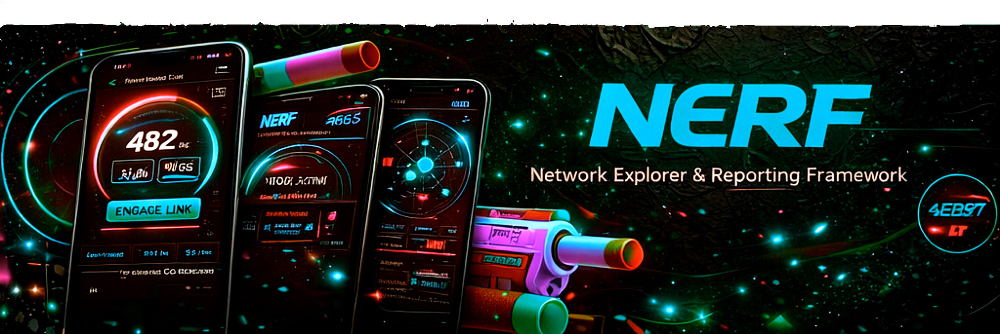
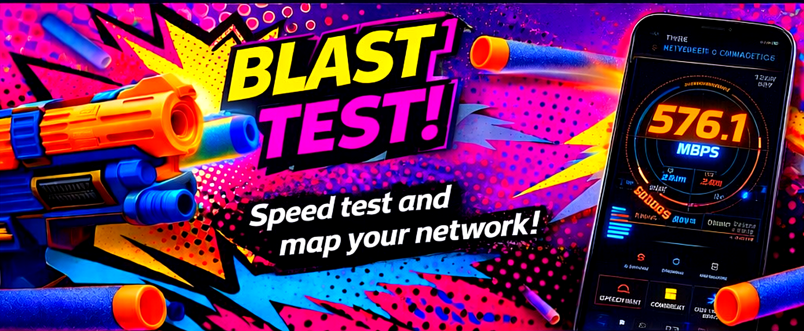
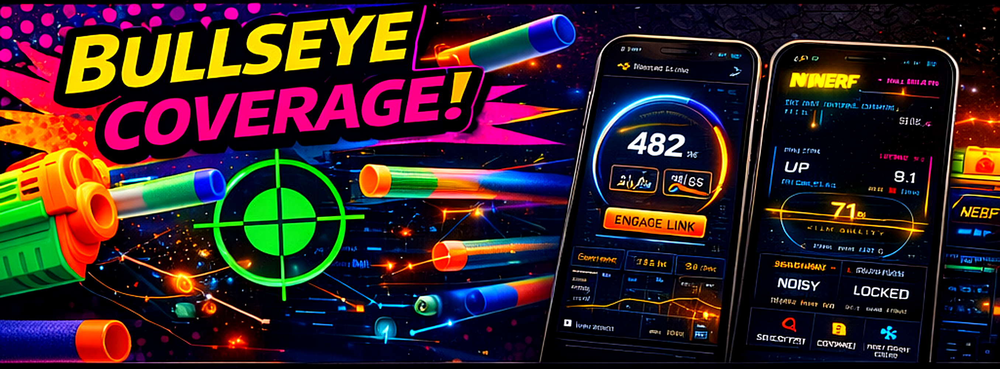

# NERF (Network Explorer & Reporting Framework)

Android-first network control and observability tool, with a WebView-powered web parity layer.

## Capabilities, Features, and Functions

### Platform + Architecture
- Android-first app built with Jetpack Compose.
- Web parity layer via HTML theme packs loaded in-app through WebView.
- Deterministic UI-to-backend wiring through interface contracts in `domain/Contracts.kt`.
- Shared service gateway (`HybridBackendGateway`) for speedtest, scanning, devices, map, topology, analytics, and router control.

### Core Screens
- Speedtest screen.
- Network Map screen.
- Devices screen.
- Analytics screen.
- Settings screen.
- Preview screen (HTML dashboard/WebView bridge runtime preview).

### Theme System (Permanent / Required)
- Native Compose theme support (`neon_nerf`).
- HTML theme packs under `app/src/main/assets/themes/*`.
- Stable theme IDs:
  - `nerf_main_dash` (html)
  - `nerf_hud_alt` (html)
  - `neon_nerf` (native)
  - `speedtest6` (html)
  - `nerf_speed2` (html)
- Theme selection persistence across app restarts.
- Runtime theme apply/revert in Settings.
- In-app HTML preview rendering for selected HTML packs.

### Speedtest Engine
- Start/stop/reset speedtest operations.
- Configurable server mode and server selection.
- Configurable download/upload payload sizes.
- Configurable threads, test duration, and request timeout.
- Real-time phases: `IDLE`, `PING`, `DOWNLOAD`, `UPLOAD`, `DONE`, `ERROR`, `ABORTED`.
- Measurements include:
  - Ping
  - Jitter
  - Packet loss
  - Download Mbps
  - Upload Mbps
  - Throughput sample timeline
- Maintains latest result and local history.
- Clearable test history.

### Network Discovery + Devices
- Deep LAN scan start/stop support.
- Scan lifecycle events:
  - Started
  - Progress
  - Device discovered/updated
  - Done
  - Error
- Device model includes:
  - ID, name, hostname, IP
  - Online/reachability state
  - RSSI/signal and latency metrics
  - MAC, vendor, type, transport
  - Gateway flag, last-seen time
  - Open-port summary and risk score
- Device control actions:
  - Ping device
  - Block device
  - Prioritize device
  - Request device details

### Map + Topology
- Map node list and topology link model.
- Layout modes: `RADIAL`, `TOPOLOGY`, `SIGNAL`.
- Topology refresh.
- Node selection support.

### Analytics
- Snapshot metrics:
  - Download/upload throughput
  - Latency/jitter/loss
  - Device totals + reachable count
  - Avg/median RTT
  - Scan duration + last scan timestamp
- Event stream + refresh support.

### Router Control
- Router info retrieval.
- Toggle guest network.
- Set QoS mode: `BALANCED`, `GAMING`, `STREAMING`.
- Renew DHCP.
- Flush DNS.
- Reboot router.
- Toggle firewall.
- Toggle VPN.

### WebView Bridge Functions (HTML Dashboard -> Native)
- `scan.start`
- `scan.stop`
- `devices.list`
- `device.ping`
- `device.block`
- `device.prioritize`
- `map.refresh`
- `speedtest.start`
- `speedtest.stop`
- `router.info`
- `router.toggleGuest`
- `router.renewDhcp`
- `router.flushDns`
- `router.rebootRouter`
- `router.toggleFirewall`
- `router.toggleVpn`
- `router.setQos`
- `analytics.snapshot`

### Mobile-First Guarantees
- Designed for narrow Android widths (~360dp target).
- No horizontal overflow or clipped UI as a done criterion.
- Theme previews and controls structured for small-screen usability.

## Quick How-To / Installation

### Prerequisites
- Android Studio (latest stable recommended).
- Android SDK configured.
- JDK 17+.

### Install + Run (Android)
1. Clone this repository.
2. Open the project folder in Android Studio.
3. Let Gradle sync complete.
4. Run the `app` configuration on an emulator or physical Android device.

### Use the App Quickly
1. Open **Settings**.
2. Pick a theme and tap **Apply Theme**.
3. Open **Preview** to verify HTML theme pack rendering.
4. Use **Speedtest**, **Devices**, **Map**, and **Analytics** tabs for diagnostics and control.

### Required Theme Packs (Do Not Remove / Rename)
- `app/src/main/assets/themes/speedtest6/index.html`
- `app/src/main/assets/themes/nerf_speed2/index.html`

## Reference Docs
- `AGENTS.md`
- `docs/THEME_SYSTEM.md`
- `docs/PRODUCT_REQUIREMENTS.md`

## Quick Troubleshooting
- App builds but theme preview is blank:
  - Confirm HTML packs exist at `app/src/main/assets/themes/<id>/index.html`.
  - Verify the selected theme is an HTML theme in **Settings**.
- Theme does not persist after restart:
  - Confirm `ThemeRepository` and settings apply path are not bypassed.
- Router actions fail:
  - Re-check router host/credentials in **Settings** and local network reachability.
- Scan finds no devices:
  - Verify device is on the same LAN/Wi-Fi segment and retry deep scan.
- UI appears clipped on narrow devices:
  - Re-test on ~360dp width and remove any layout introducing horizontal overflow.
